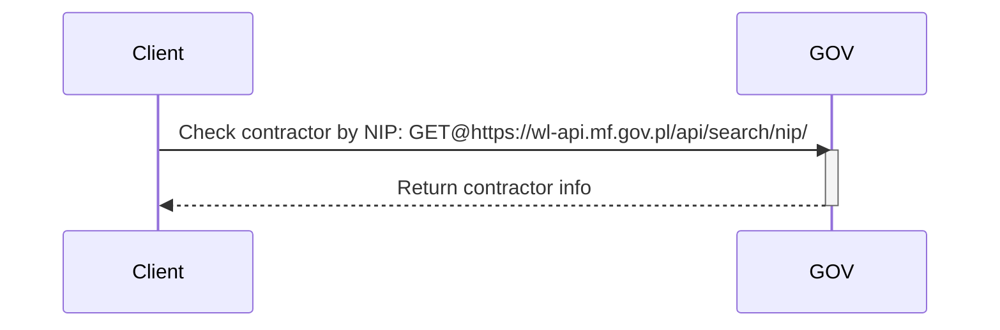

# Contractors white list checking with POCO library

## Program usage: 

```bash
poco_wl_client -n NIP

```
where NIP is contractor tax id.

# Diagram sequence communication


```mermaid
sequenceDiagram

participant Client
participant WL-service as GOV

Client ->> WL-service : Check contractor by NIP: GET@https://wl-api.mf.gov.pl/api/search/nip/
activate WL-service

WL-service -->> Client : Return contractor info
deactivate WL-service

```
